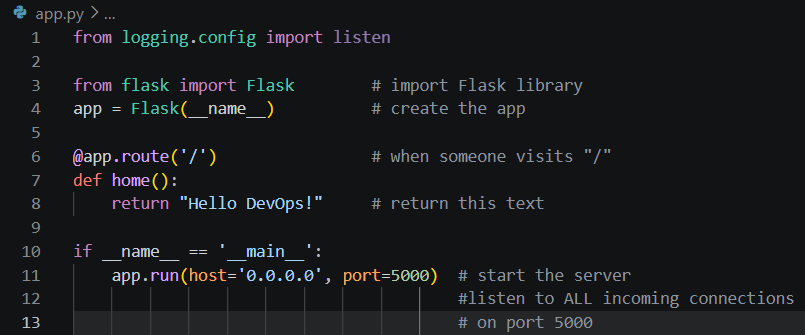
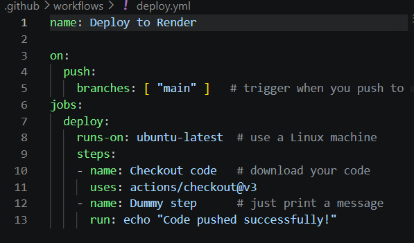
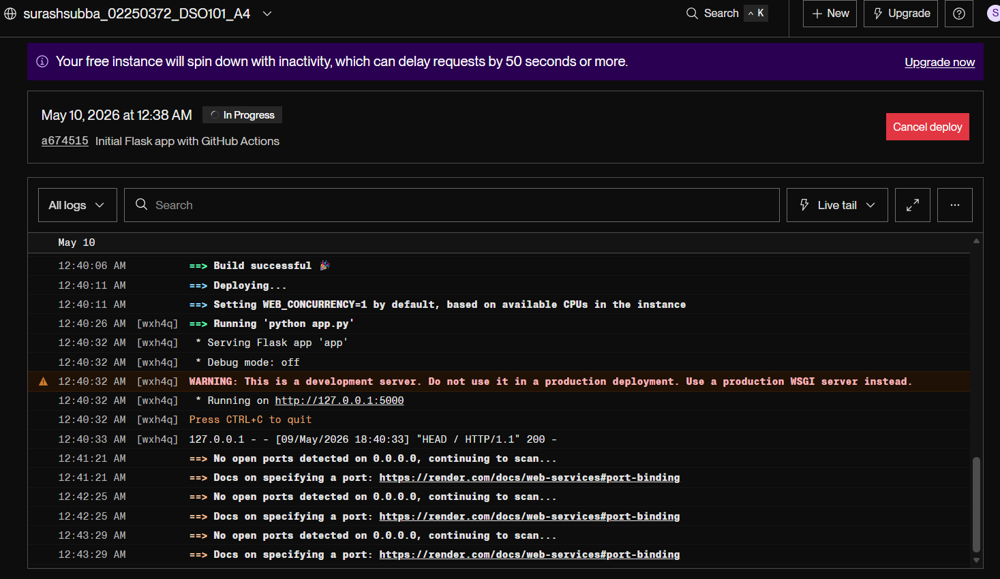
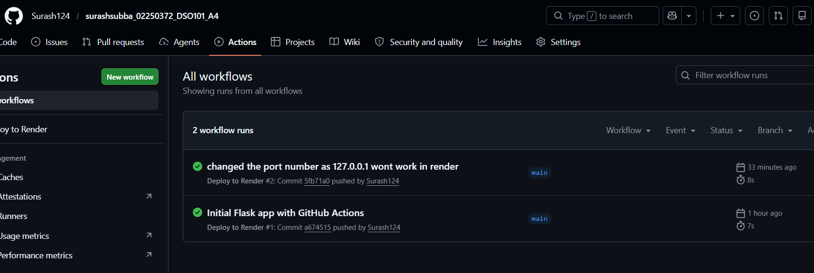
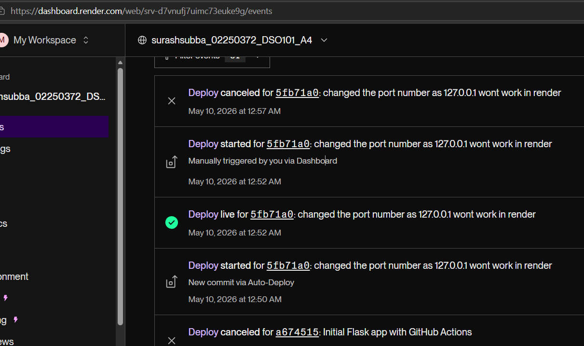
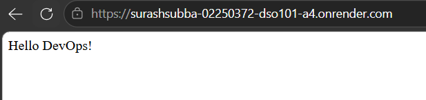

# surashsubba_02250372_DSO101_A4
Deploy my First Web App using GitHub &amp; Render

# Deploy Your First Web App using GitHub & Render (DSO101 - Assignment 4)

## Live Application

**URL:** https://surashsubba-02250372-dso101-a4.onrender.com

---

##  Repository

**GitHub:** https://github.com/Surash124/surashsubba_02250372_DSO101_A4

---

##  Project Overview
This is a basic flask web application. Whenever someone visits this page it shows "Hello DevOps!". It is automated to be deployed on Render.com using GitHub Actions when you push new code into the main branch.


##  Tools Used
1. GitHub: Code hosting platform
2. GitHub Actions: Continuous integration & continuous delivery automation
3. Render.com: Cloud platform for deployment
4. Flask (Python): Web framework


##  Project Structure

```
surashsubba_02250372_DSO101_A4/
├── .github/
│   └── workflows/
│       └── deploy.yml
├── app.py
├── requirements.txt
└── README.md
```


##  Implementation Steps

### Step 1: Create Flask App
Created `app.py` with a simple route:



Note: setting host='0.0.0.0' is needed for the app to be deployed on Render, as Flask normally listens on 127.0.0.1, i.e., on localhost but it is unreachable for Render. Setting host='0.0.0.0' makes the app accessible from the internet.
### Step 2: Create requirements.txt
```
flask
```

### Step 3: Create GitHub Actions Workflow
Created `.github/workflows/deploy.yml`:



### Step 4: Push to GitHub
```bash
git add .
git commit -m "Flask app with GitHub Actions"
git push origin main
```

### Step 5: Deploy on Render
- Connected GitHub repo to Render
- Selected **Web Service**
- Set runtime to **Python 3**
- Build command: `pip install -r requirements.txt`
- Start command: `python app.py`
- Region: Singapore
- Plan: Free

---

##  Challenges Faced

### Challenge: "No open ports detected" on Render

**Problem:** Initial deployment failed with:
```
No open ports detected on 0.0.0.0, continuing to scan...
```


**Root Cause:** Flask was running on `127.0.0.1` (localhost only) by default:
```python
app.run()  # only listens locally
```

**Fix:** Changed to listen on all interfaces:
```python
app.run(host='0.0.0.0', port=5000)  # listens to all connections
```

**Lesson Learned:** When deploying to cloud platforms, always bind to `0.0.0.0` so the server accepts external connections. `127.0.0.1` only works locally.

---

##  Learning Outcomes
Learned Outcomes
- Learn how to build and deploy a simple Flask web application
- Learn to know the difference between `127.0.0.1` (localhost) and `0.0.0.0` (all interfaces)
- Learn how to connect the GitHub repository with the Render service to automatically deploy the application
- Learn to know how the GitHub Actions are automatically triggered in the Main.


##  Screenshots

GitHub Actions Success




Render Deployment



Live App
 |


## License

This project is developed as a part of DSO101 assignment 4 for academic purpose only.